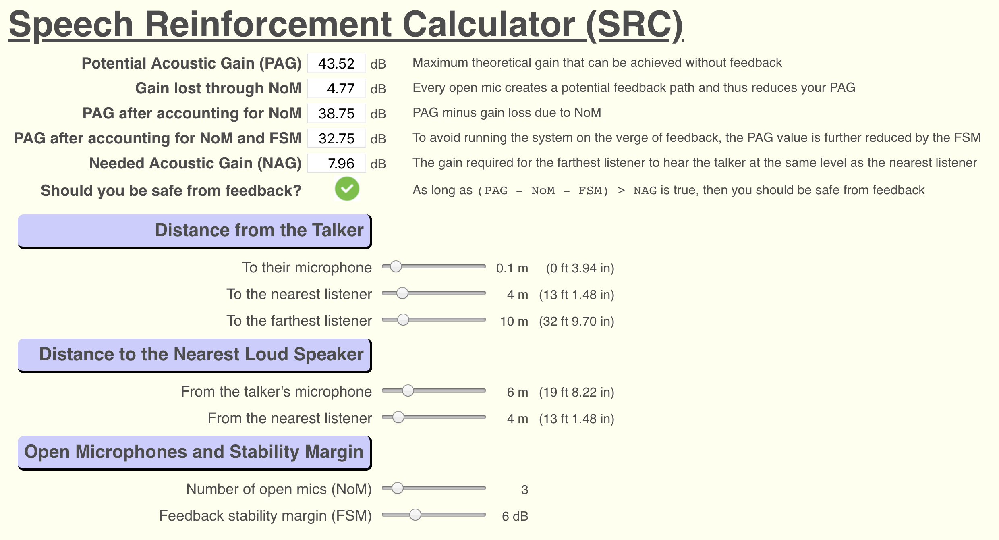

# Speech Reinforcement Calculator

Calculates needed acoustic gain (NAG) compared to potential acoustic gain (PAG) and accounts for gain loss due to open mics and a feedback stability margin.

The Web page was written as an exercise in getting a Web Assembly program (originally written in Rust) to interact with the JavaScript coding running in a browser.

## Architecture

The WASM function receives 6 arguments and from these, it calculates various gain values.  This functionality is trivial because the learning objective here is familiarisation with how a WASM module interacts with JavaScript via the [`wasm-bindgen`](https://rustwasm.github.io/wasm-bindgen/introduction.html) and [`serde`](https://serde.rs/) libraries.

## Installation

These instructions assume you have already installed Rust and `wasm-pack`, and that Python3 is available to act as a Web server.

1. Clone this repo
2. Change into the top-level directory
3. Compile using `wasm-pack build --release --target web`
4. Start a Python3 Web server using `python3 -m http.server`
5. Visit <http://0.0.0.0:8000>

## Usage

All inputs are made using the range sliders.  The sliders can be moved either by dragging the button with the mouse, or for more precise input, select the slider and use the left/right arrow keys.

***Warning***  
This version of the software does not perform any plausibility checks for the input values.  Therefore it is possible to create implausible input combinations; for instance, having the nearest listener positioned further away than the farthest listener.

If you notice the `NAG` value has become negative, then you have an implausible combination of input values.

